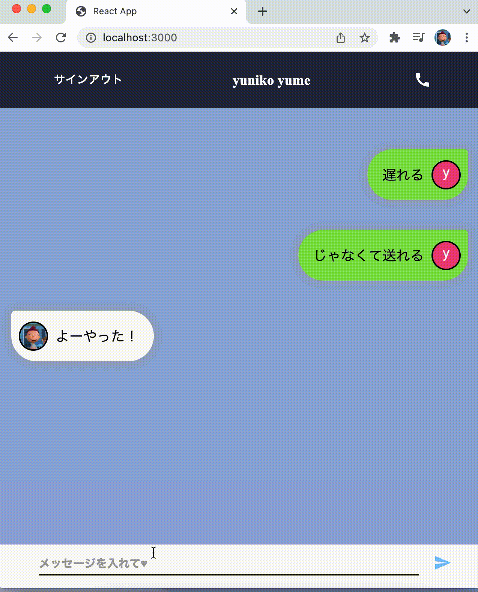
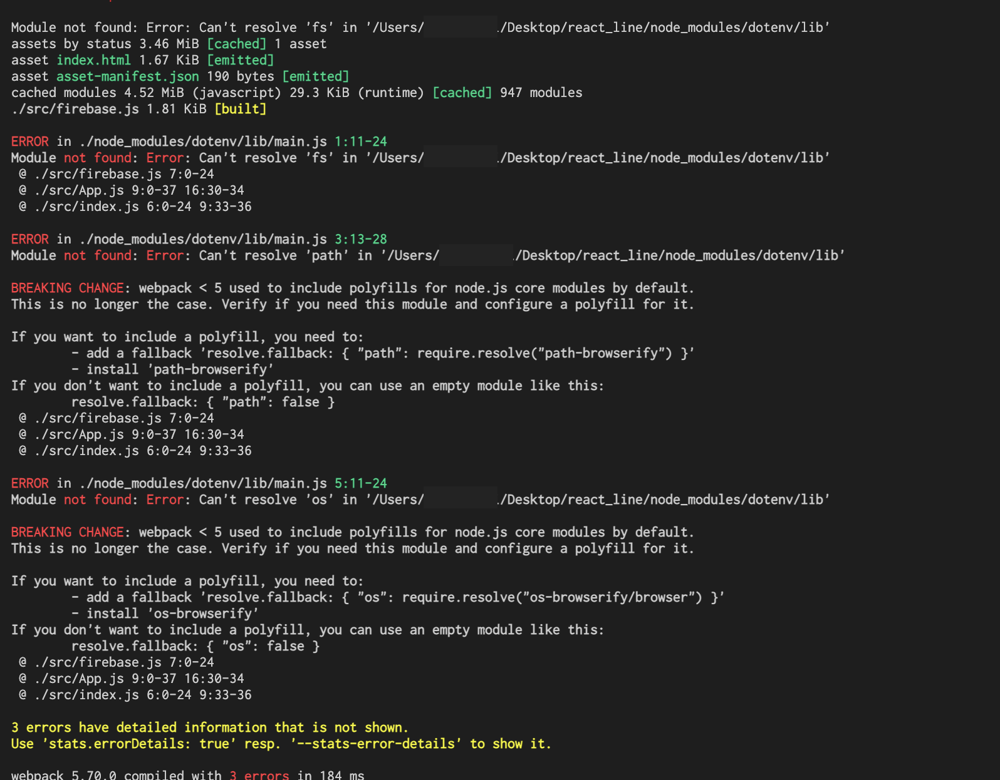

# Getting Started with Create React App

This project was bootstrapped with [Create React App](https://github.com/facebook/create-react-app).

### 問題があります
環境変数設定のために、dotenvをインストールして使うとエラーになります
apiKeyを隠せません  
  

 

